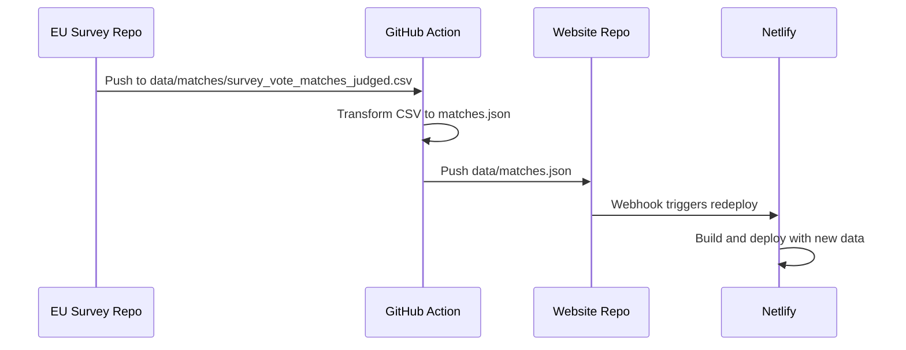

# GitHub Action: Survey-Vote Data Sync Pipeline

## Architecture



## Implementation

### 1. Create the GitHub Action Workflow

Create [`.github/workflows/sync-matches.yml`](.github/workflows/sync-matches.yml):

- **Trigger**: On push to `data/matches/survey_vote_matches_judged.csv` on main branch
- **Steps**:

  1. Checkout eu_survey_correlation repo
  2. Run Python script to convert CSV to JSON (filter `llm_go=True` only)
  3. Checkout website repo using a PAT secret
  4. Copy `matches.json` to `data/` folder
  5. Commit and push to website repo

### 2. Create the CSV-to-JSON Transform Script

Create [`backend/scripts/export_matches_json.py`](backend/scripts/export_matches_json.py):

```python
# Reads survey_vote_matches_judged.csv
# Filters to llm_go == True
# Outputs clean JSON with structure:
# {
#   "generated_at": "2026-02-08T...",
#   "total_matches": 45,
#   "matches": [
#     {
#       "question_id": "QB7_2",
#       "question_text": "...",
#       "vote_id": "153918",
#       "vote_summary": "...",
#       "similarity_score": 0.79,
#       "llm_score": 9
#     }
#   ]
# }
```

### 3. Configure GitHub Secrets

In the **EU Survey repo** settings, add:

| Secret Name | Description |

|-------------|-------------|

| `WEBSITE_REPO_PAT` | Personal Access Token with `repo` scope for pushing to website repo |

### 4. Netlify Auto-Deploy

Netlify automatically redeploys when new commits are pushed to the connected branch. No additional configuration needed if the website repo is already linked to Netlify.

---

## Required Information

Before implementation, please provide:

- **Website repository name** (e.g., `michlougo/dawta-website`)

---

## Files to Create

| File | Purpose |

|------|---------|

| `.github/workflows/sync-matches.yml` | GitHub Action workflow |

| `backend/scripts/export_matches_json.py` | CSV to JSON transformation |

## Estimated Output

The `matches.json` will contain only validated matches (where `llm_go=True`), currently ~45 high-quality survey-vote pairs based on the judged CSV.