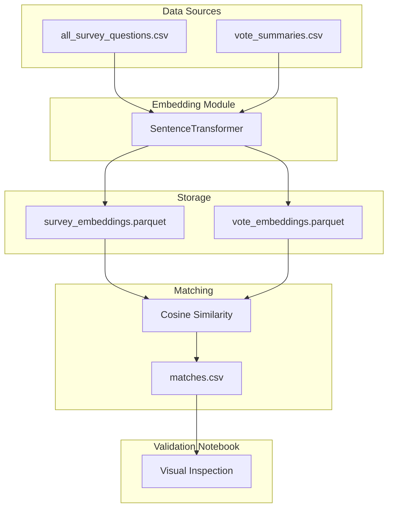

# Survey-Vote Semantic Matching Pipeline

## Data Overview

| Dataset | Records | Key Text Field |
|---------|---------|----------------|
| Survey questions | ~4,119 | `question_en` |
| Votes | ~23,015 | `procedure_title`, `display_title` |
| Vote summaries | ~5,582 | `summary` (detailed text) |

## Architecture



## Project Structure

```
backend/
├── src/eu_survey_correlation/
│   ├── embeddings/
│   │   ├── __init__.py
│   │   ├── embedder.py          # SentenceTransformer wrapper
│   │   └── matcher.py           # Similarity computation
│   └── ...
├── scripts/
│   ├── embed_surveys.py         # CLI to embed survey questions
│   ├── embed_votes.py           # CLI to embed vote summaries
│   └── find_matches.py          # CLI to compute matches
└── notebooks/
    └── 4_validate_matches.ipynb # Visual validation
data/
├── embeddings/
│   ├── survey_embeddings.parquet
│   └── vote_embeddings.parquet
└── matches/
    └── survey_vote_matches.csv
```

## Implementation Steps

### 1. Create Embedding Module

Create [`backend/src/eu_survey_correlation/embeddings/embedder.py`](backend/src/eu_survey_correlation/embeddings/embedder.py):
- Wrapper class around `SentenceTransformer`
- Batch embedding with progress bar
- Model: `all-MiniLM-L6-v2` (fast, good quality) or `paraphrase-multilingual-MiniLM-L12-v2` (if multilingual needed)

### 2. Create Matching Module

Create [`backend/src/eu_survey_correlation/embeddings/matcher.py`](backend/src/eu_survey_correlation/embeddings/matcher.py):
- Load embeddings from parquet
- Compute cosine similarity matrix
- Extract top-k matches per survey question above a threshold

### 3. CLI Scripts

**`embed_surveys.py`**: Read survey questions, embed `question_en`, save to parquet with metadata (sheet_id, file_name)

**`embed_votes.py`**: Read vote summaries, embed `summary` field, save to parquet with metadata (vote_id)

**`find_matches.py`**: Load both embeddings, compute similarities, output matches CSV with columns: `question_id`, `vote_id`, `similarity_score`, `question_text`, `vote_summary`

### 4. Validation Notebook

Create [`backend/notebooks/4_validate_matches.ipynb`](backend/notebooks/4_validate_matches.ipynb):
- Load matches CSV
- Display side-by-side: survey question vs matched vote summary
- Filter by similarity threshold
- Manual inspection to tune threshold (start with 0.5, adjust based on quality)

## Key Decisions

| Decision | Recommendation |
|----------|----------------|
| **Model** | `all-MiniLM-L6-v2` - 384 dims, fast, English-optimized |
| **Storage** | Parquet (efficient, keeps metadata) |
| **Similarity** | Cosine similarity |
| **Threshold** | Start at 0.5, tune via notebook |
| **Top-k** | Keep top 5 matches per question |

## Execution Order

1. Run `embed_surveys.py` → generates `survey_embeddings.parquet`
2. Run `embed_votes.py` → generates `vote_embeddings.parquet`
3. Run `find_matches.py` → generates `survey_vote_matches.csv`
4. Open `4_validate_matches.ipynb` → inspect quality, tune threshold